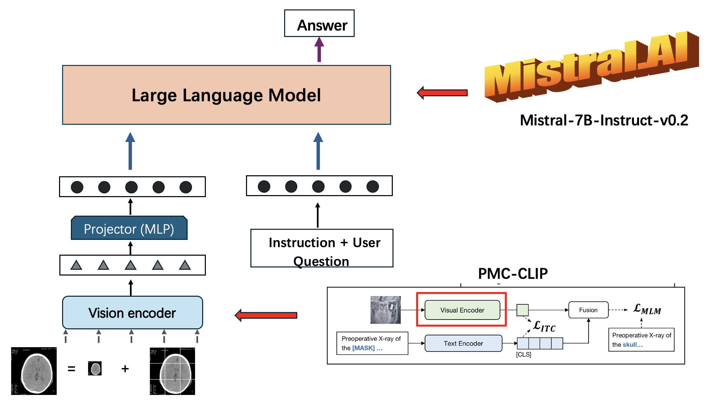

# PMC-LLaVA: Multi-modal Large Model in Medical Q&A

## Contents

- [Model Description](#model-description)
- [Install](#install)
- [Model Download](#model-download)
- [Serving](#serving)
- [Data Preparation](#data-preparation)
- [Training](#training)
- [Evaluation](#evaluation)

## Model Description 

PMC-LLaVA is a vision language model for the medical domain built with reference to LLaVA, which can help users to conduct image-based Q&A.
<p align="center">
     <br>
</p>
## Install

1. Clone this repository and Clone LLaVA repository
```bash
git clone https://github.com/theon1130/CS45_2_S1_2024.git
```

```bash
git clone https://github.com/haotian-liu/LLaVA.git
```
2. Use the environment of LLaVA
```bash
cd LLaVA
```
3. Install Package: Create conda environment

```Shell
conda create -n PMC-LLaVA python=3.10 -y
conda activate PMC-LLaVA
pip install --upgrade pip  # enable PEP 660 support
pip install -e .
```

```Shell
pip install -q datasets
pip install transformers -q -U
pip install -q bitsandbytes sentencepiece accelerate loralab
pip install -q -U git+https://github.com/huggingface/peft.git
pip install hf_transfer -q -U
pip install pickleshare -q
```

  Install for training
```Shell
pip install protobuf -q -U
pip install --upgrade Pillow -q
pip install -e ".[train]" -q
pip install flash-attn --no-build-isolation -q
```
## Model Download

If you want to use the Qformer version of PMC-LLaVA, you need to manually change the value of the *"use_q"* parameter in the forward and generate in the llava/model/language_model/llava_mistral.py file to be set to *True*, the default value is set to *False*, i.e., the default does not use the qformer version.


1. PMC-LLaVA

 Model | 🤗 Huggingface Hub | 
| --- | ---: |
| PMC_llava-v1.6-mistral | [Theon1130/PMC_llava-v1.6-mistral](https://huggingface.co/Theon1130/PMC_llava-v1.6-mistral) |
| pmc_vit | [ryanyip7777/pmc_vit-l-14_hf](https://huggingface.co/ryanyip7777/pmc_vit-l-14_hf) |

  *You can also download the model weights for the different stages separately.*

 Models | 🤗 Huggingface Hub | Model Description |
| --- | --- |---: |
| PMC_llava-v1.6-mistral-unmerged | [Theon1130/PMC_llava-v1.6-mistral-unmerged](https://huggingface.co/Theon1130/PMC_llava-v1.6-mistral-unmerged) | After alignment training using ROCO |
| Slake_loRA_weights_1 | [Theon1130/2ndslake](https://huggingface.co/Theon1130/2ndslake) | LoRA Weights 1 |
| Slake_loRA_weights_2 | [Theon1130/3rdslake](https://huggingface.co/Theon1130/3rdslake) | LoRA Weights 2 |
  
2. PMC-LLaVA-Qformer
   
 Models | 🤗 Huggingface Hub | Model Description |
| --- | --- |---: |
| PMC_llava-v1.6-mistral-qformer | [Theon1130/PMC_llava-v1.6-mistral-qformer](https://huggingface.co/Theon1130/PMC_llava-v1.6-mistral-qformer) | After alignment training using ROCO |
| pmc_vit | [ryanyip7777/pmc_vit-l-14_hf](https://huggingface.co/ryanyip7777/pmc_vit-l-14_hf) | Vision encoder  |
| querytokens | [Theon1130/querytokens](https://huggingface.co/Theon1130/querytokens) | querytokens from each stage of training  |
| Slake_loRA_weights | [Theon1130/loraqformerslake](https://huggingface.co/Theon1130/loraqformerslake) | LoRA Weights |

  *You need to merge the lora weights onto the aligned trained model and choose the corresponding querytoken.*

After download the model file, you need to manually modify the *config.json* file, and modify the *"mm_vision_tower"* to the path of the *pmc_vit-l-14_hf* you downloaded.

Apart from the py files, we also provide notebook files that you can read or use directly to help you get the most out of our models!

## Serving

### Terminal Inference

```Shell
python inference.py --model_path /Path/To/PMC_llava-v1.6-mistral --image_path image.jpg --qs "What is in the image?" --use_q False
```

### Web UI

Please manually change the *.env* file and set your model path

Based on gradio, default host is 127.0.0.1, and port is 8000 

#### Windows
```Shell
webui.bat
```

#### Linux
```Shell
./webui.sh
```

## Data Preparation

### Stage-1 Alignment
| Data name | Size |
| --- | ---: |
| [ROCO](https://huggingface.co/datasets/Theon1130/ROCO_for_training) | 6.65GB |

### Stage-2 Finetune

| Data name | Size |
| --- | ---: |
| [SLAKE](https://huggingface.co/datasets/Theon1130/SLAKE-for-finetune) | 213 MiB |

Download and unzip the data, you need to manually modify the *preprocess_data.py* file, and modify the file path.

## Training

Before evaluation or training, please double check the path for data in preprocess_data.py.

Before training, please check and modify the wandb configuration information in the training file separately.

### Hyperparameters
1. Alignment

| Global Batch Size | Learning rate | Epochs |
| --- | ---: | ---: |
| 32 | 4e-5 | 2 |

2. Finetuning

| Global Batch Size | Learning rate | Epochs | Lora rank | Lora alpha | Lora dropout |
| --- | ---: | ---: | ---: | ---: | ---: |
| 32 | 2e-5 | 5 | 32 | 64 | 0.1 |


### Stage-1 Alignment

```Shell
python stage1_train.py --model_path <model_path> --data_path <data_path>
```

### Stage-2 Finetune

```Shell
python stage2_train.py --model_path <model_path> --dataset <dataset>
```
## Evaluation

Before evaluation or training, please double check the path for data in preprocess_data.py.

### Run evaluation on the SLAKE

```Shell
python run_on_benchmark_slake.py --model_path /Path/To/PMC_llava-v1.6-mistral --save_path ./results --use_q False
```

## Related Projects

- [LLaVA](https://llava-vl.github.io/)
- [LLaVA-Med](https://github.com/microsoft/LLaVA-Med/tree/main)
- [PMC-CLIP](https://weixionglin.github.io/PMC-CLIP/)
